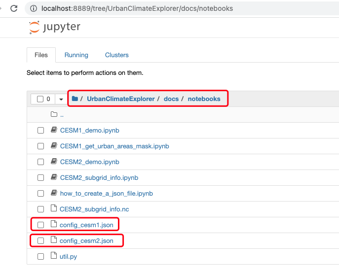
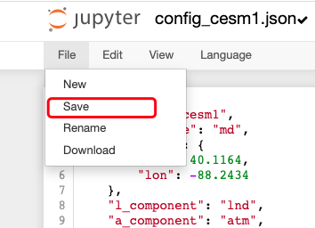
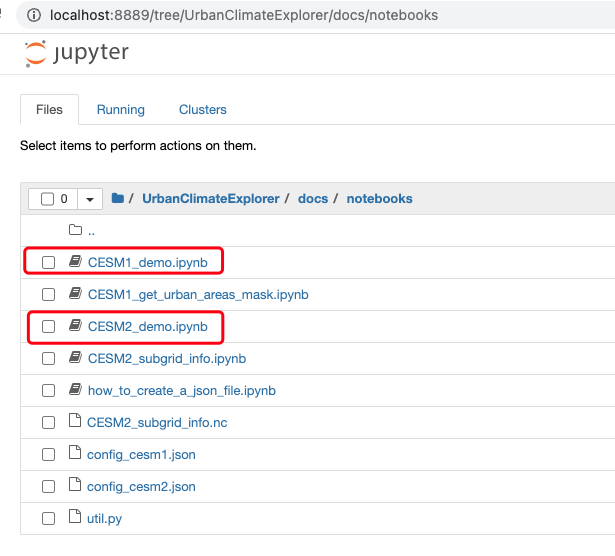

## Setup

- Step 1: Follow [Instal and Run](./install_run.html) to launch a jupyter notebook locally or using HPC.

- Step 2: Open `config_cesm1.json` or `config_cesm2.json`.

  

- Step 3: If you are not familiar with CESM1 or CESM2, you can just edit `city_loc` and `time_start` and `time_end`. 

  - Please check [here](../notebooks/how_to_create_a_json_file.html) for more information about JSON file.
  - Please check [here](https://ncar.github.io/cesm-lens-aws/#data-catalog) for CESM1 variables and [here](https://ncar.github.io/cesm2-le-aws/model_documentation.html#data-catalog) for CESM2 variables

- Step 4: Save the JSON file

  

- Step 5: Open `CESM1_demo.ipynb` or `CESM2_demo.ipynb`, depends on which JSON you have edited. Now you are all set!

  
